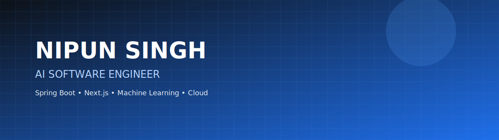

  

  

<h1 align="center">Nipun Singh</h1>
<h3 align="center">Building Intelligent Software Systems</h3>

  
  
  
  

---

## About

Computer Science undergraduate focused on building production-grade backend systems and AI-powered software products.

**Current Focus**
- PKOS – Personal Knowledge Operating System
- Computer Vision & AI
- Cloud Infrastructure
- AI Software Engineer / SDE Roles

---

## Tech Stack

---

## Featured Projects

| Project | Description |
|---------|-------------|
| **PKOS** | AI-powered Personal Knowledge Operating System |
| **DuoBooth** | Collaborative virtual photo booth |
| **Hospital Bed Optimization** | Machine Learning dashboard |
| **Java ATM Simulation** | Java Swing + JDBC desktop application |

## GitHub Analytics

---

## Connect

- Portfolio: https://nipunsingh.vercel.app
- LinkedIn: https://www.linkedin.com/in/nipun-singh/
- GitHub: https://github.com/nipunsingh2
- Email: nipun4654@gmail.com

---

Designed & Developed by <b>Nipun Singh</b>

