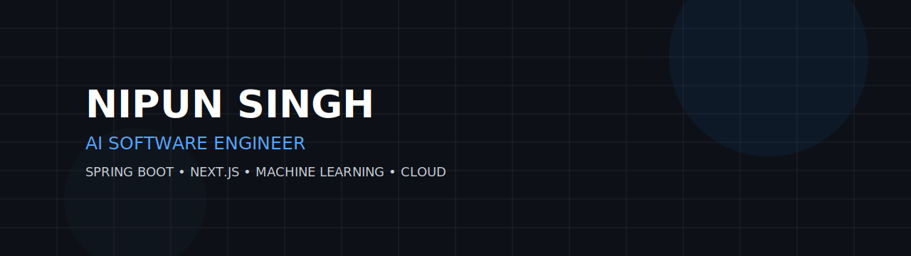

<!-- ========================================= -->
<!--              NIPUN SINGH                  -->
<!-- ========================================= -->

<p align="center">



</p>

<p align="center">


</p>

<p align="center">

<a href="https://github.com/nipunsingh2">

</a>

<a href="YOUR_LINKEDIN_URL">

</a>

<a href="https://nipunsingh.vercel.app">

</a>

<a href="mailto:YOUR_EMAIL">

</a>

</p>

---

# About

```text
Computer Science undergraduate focused on building
modern backend systems, AI-powered applications and
scalable web platforms.

I enjoy solving real-world problems using software
engineering, machine learning and cloud technologies.
```

---

# Current Focus

| | |
|:---|:---|
| Building | PKOS – Personal Knowledge Operating System |
| Learning | Computer Vision & AI |
| Exploring | Cloud Infrastructure |
| Goal | AI Software Engineer / Software Development Engineer |

---

# Technology Stack

<p align="center">


</p>

---

# Featured Projects

## PKOS

Production-grade Personal Knowledge Operating System.

**Stack**

- Spring Boot
- PostgreSQL
- JWT Authentication
- Redis
- OCR
- REST APIs

---

## DuoBooth

Virtual collaborative photo booth experience.

**Stack**

- Next.js
- TypeScript
- Tailwind CSS

---

## Hospital Bed Optimization

Machine Learning solution for hospital resource optimization.

**Stack**

- Python
- Random Forest
- Streamlit
- SQLite

---

## Vocabulary Enhancement AI Bot

AI-powered vocabulary learning assistant.

**Stack**

- Next.js
- Gemini API
- Tailwind CSS

---

# GitHub Statistics

<p align="center">


</p>

<p align="center">


</p>

---
# Contribution Activity

<p align="center">


</p>

---

# GitHub Profile Summary

<p align="center">


</p>

<p align="center">


</p>

---

# Achievements

<p align="center">


</p>

---

# Coding Activity

<p align="center">


</p>

> **Note:** This section only works if you use WakaTime. Otherwise, you can remove it later.

---

# Connect

<p align="center">

<a href="YOUR_LINKEDIN_URL">

</a>

&nbsp;&nbsp;&nbsp;&nbsp;

<a href="https://nipunsingh.vercel.app">

</a>

&nbsp;&nbsp;&nbsp;&nbsp;

<a href="mailto:YOUR_EMAIL">

</a>

&nbsp;&nbsp;&nbsp;&nbsp;

<a href="https://github.com/nipunsingh2">

</a>

</p>

---

<p align="center">

> *Building scalable software, intelligent systems and meaningful products.*

</p>

---

<p align="center">


</p>
